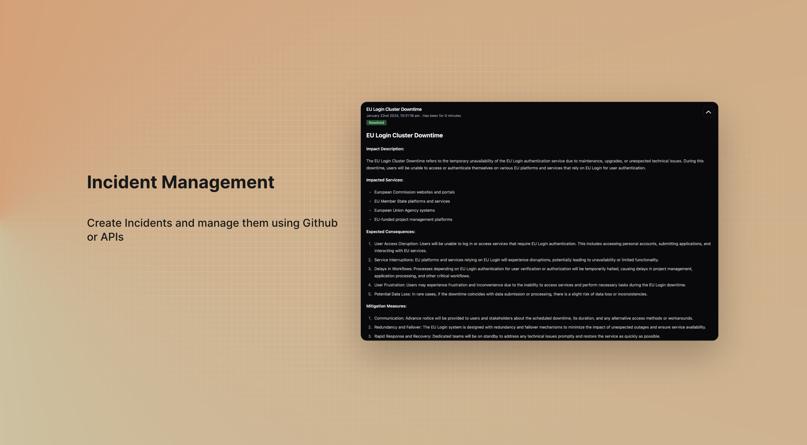
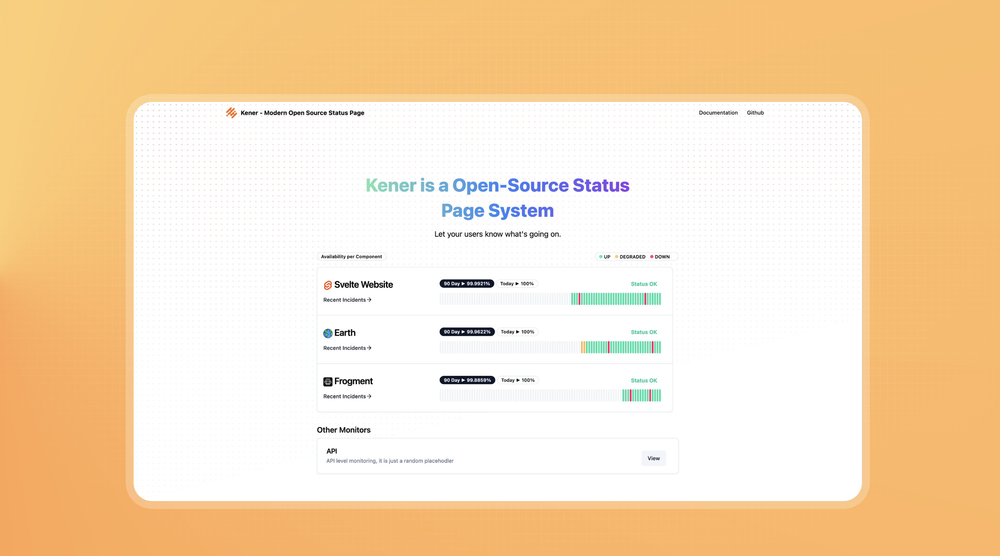

# sveltekit

This repo contains code for a SvelteKit application generated using the [`create-svelte`](https://github.com/sveltejs/kit/tree/master/packages/create-svelte) package.

To create your own SvelteKit project, you can either

- [Create your own repo from this template](https://github.com/render-examples/sveltekit/generate) and modify it for your needs
- Create a new SvelteKit project by following the [SvelteKit Getting Started Guide](https://kit.svelte.dev/docs) and then making a few small modifications as shown in [this commit](https://github.com/render-examples/sveltekit/commit/3ea50803f118da041745fd8cb51094972ac87f3c) to deploy it to Render as a Node.js service.

## Developing

Once you've created a project and installed dependencies with `npm install` (or `pnpm install` or `yarn`), start a development server:

```bash
npm run dev

# or start the server and open the app in a new browser tab
npm run dev -- --open
```

## Building

```bash
npm run build
```

> You can preview the built app with `npm run preview`. This should _not_ be used to serve your app in production.

## Deploying to Render

Follow the deploy instructions at https://render.com/docs/deploy-sveltekit

[](https://render.com/deploy?repo=https://github.com/render-examples/sveltekit)


<p align="center">
	
</p>
 

<p align="center">
	
	<a href="https://github.com/ivbeg/awesome-status-pages"></a>
</p>

#### 👉 Visit a live server [here](https://kener.ing)

#### 👉 Read the documentation [here](https://kener.ing/docs) 

# Kener - Status Page System
Kener: Open-source Node.js status page tool, designed to make service monitoring and incident handling a breeze. It offers a sleek and user-friendly interface that simplifies tracking service outages and improves how we communicate during incidents. And the best part? Kener integrates seamlessly with GitHub, making incident management a team effort—making it easier for us to track and fix issues together in a collaborative and friendly environment.

It uses files to store the data. Other adapters are coming soon
  

## Features

**Monitoring and Tracking:**
- Real-time monitoring
- Polls HTTP endpoint or Push data to monitor using Rest APIs
- Handles Timezones for visitors
- Categorize Monitors into different Sections
- Cron-based scheduling for monitors. Minimum per minute
- Flexible monitor configuration using YAML. Define your own parsing for monitor being UP/DOWN/DEGRADED
- Construct complex API Polls - Chain, Secrets etc
- Supports a Default Status for Monitors. Example defaultStatus=DOWN if you dont hit API per minute with Status UP

**Customization and Branding:**
- Customizable status page using yaml or code
- Badge generation for status and uptime of Monitors
- Support for custom domains
- Embed Monitor as an iframe or widget
- Light + Dark Theme

**Incident Management:**
- Create Incidents using Github Issues - Rich Text
- Or use APIs to create Incidents

**User Experience and Design:**
- 100% Accessibility Score
- Easy installation and setup
- User-friendly interface
- Responsive design for various devices
- Auto SEO and Social Media ready


## Technologies used
- [SvelteKit](https://kit.svelte.dev/)
- [shadcn-svelte](https://www.shadcn-svelte.com/)

## Inspired from 
- [Upptime](https://upptime.js.org/)

## Roadmap
- [ ] Add notification
- [x] Add api to create incident
- [ ] Add Mysql adapter

## Screenshots








## Support

<a href="https://stackexchange.com/users/3713933"></a>

<a href="https://www.buymeacoffee.com/rajnandan1"></a>

<a href="https://www.paypal.com/paypalme/rajnandan1"></a>
